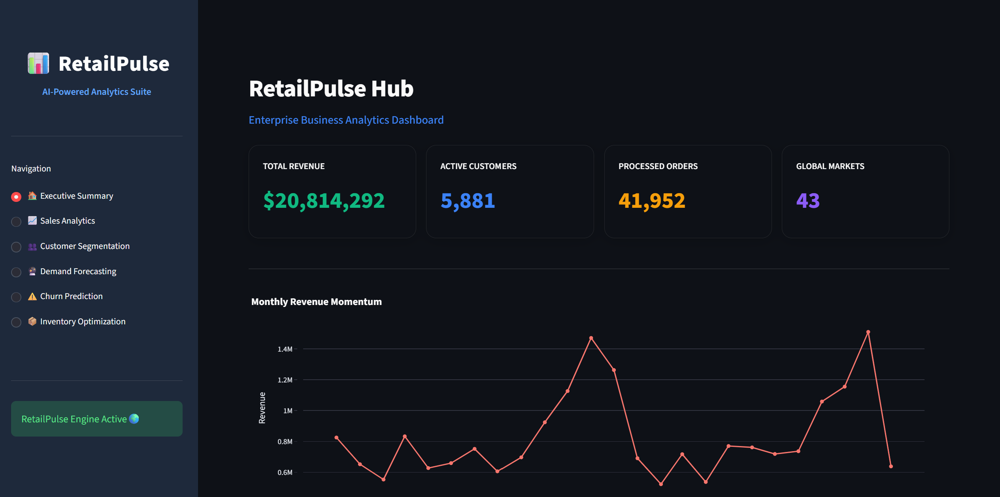
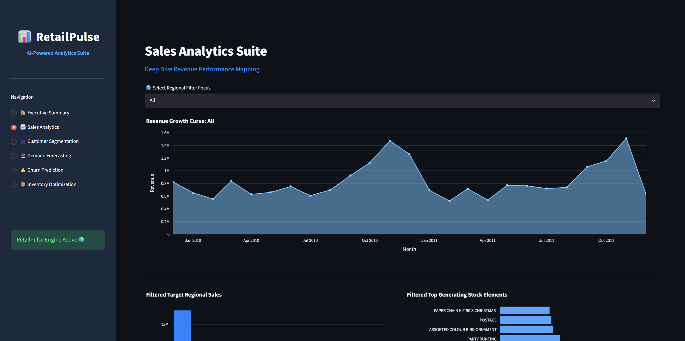
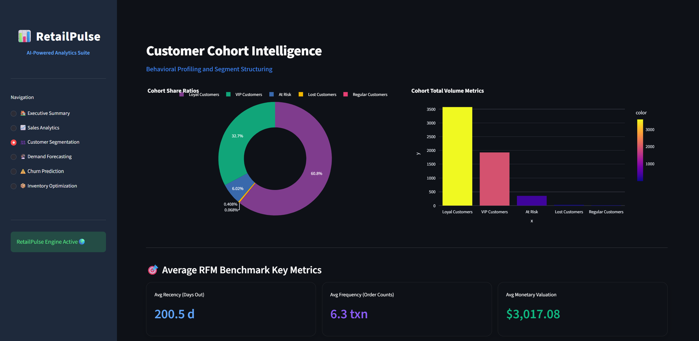
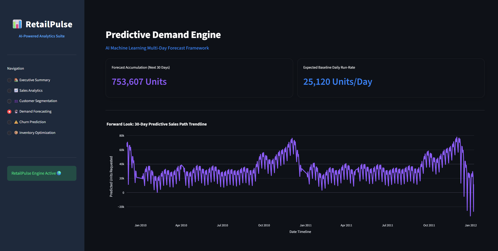
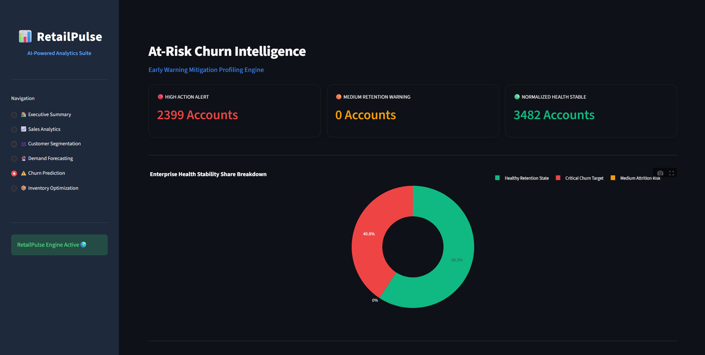
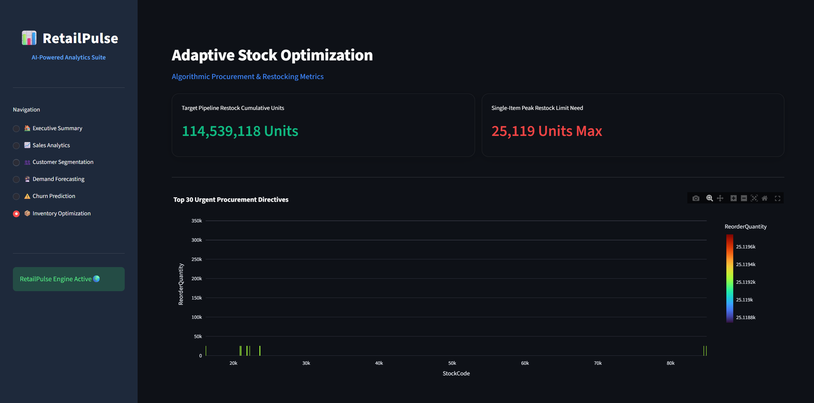

# 🛍️ RetailPulse – AI Powered Retail Analytics Platform

<div align="center">


### 🚀 AI-Powered Customer Analytics, Demand Forecasting & Inventory Optimization Platform

📊 Customer Segmentation 
🔮 Demand Forecasting 
⚠️ Churn Prediction 
📦 Inventory Optimization

</div>

---

## 🌐 Live Demo

🔗 **Streamlit Deployment:**
https://retail-pulse-dashboard.streamlit.app/

📂 **GitHub Repository:**
https://github.com/Arnavj217/Retail-Pulse-Dashboard

---

# 📖 Project Overview

RetailPulse is a complete retail analytics platform designed to transform raw transaction data into meaningful business insights.

The platform leverages:

✅ Data Analytics

✅ Machine Learning

✅ Customer Intelligence

✅ Demand Forecasting

✅ Business Intelligence Dashboards

Using the Online Retail II dataset, RetailPulse helps retailers:

* Understand customer behavior
* Identify valuable customers
* Predict future sales demand
* Detect customer churn
* Optimize inventory levels
* Improve business decision-making

---

# 🎯 Business Problem

Retail businesses generate millions of transactions every year.

However, organizations often struggle with:

🔹 Identifying high-value customers

🔹 Understanding buying patterns

🔹 Forecasting future sales

🔹 Detecting customer churn

🔹 Managing inventory efficiently

RetailPulse solves these challenges through advanced analytics and machine learning models.

---

# 📊 Dataset Information

### Dataset

Online Retail II Dataset

### Source

UCI Machine Learning Repository

### Dataset Highlights

📌 1,067,371+ Transactions

📌 5,878 Customers

📌 Multiple Countries

📌 Time Range: 2009 – 2011

### Features

| Feature     | Description         |
| ----------- | ------------------- |
| Invoice     | Invoice Number      |
| StockCode   | Product Code        |
| Description | Product Name        |
| Quantity    | Purchased Quantity  |
| InvoiceDate | Transaction Date    |
| Price       | Unit Price          |
| Customer ID | Customer Identifier |
| Country     | Customer Country    |

---

# 🚀 Key Features

## 📈 Sales Analytics

* Revenue KPIs
* Monthly Sales Trends
* Top Countries Analysis
* Top Products Analysis

## 👥 Customer Analytics

* Customer Purchase Patterns
* Top Spending Customers
* Purchase Frequency Analysis

## 🎯 Customer Segmentation

RFM Analysis:

* Recency
* Frequency
* Monetary Value

Customer Groups:

⭐ VIP Customers

💎 Loyal Customers

🛒 Regular Customers

⚠️ At-Risk Customers

❌ Lost Customers

---

## 🔮 Demand Forecasting

Using Facebook Prophet

Features:

✅ Daily Revenue Forecasting

✅ Future Sales Prediction

✅ 30-Day Demand Forecast

---

## ⚠️ Customer Churn Prediction

Using XGBoost Classifier

Predicts:

* Customers likely to leave
* Churn Risk Probability
* Customer Retention Opportunities

---

## 📦 Inventory Optimization

Inventory Intelligence:

* Reorder Recommendations
* Safety Stock Analysis
* Demand-Based Planning
* Inventory Health Monitoring

---

# 🏗️ Project Architecture

Data Collection
↓
Data Cleaning
↓
Exploratory Data Analysis
↓
Feature Engineering
↓
Customer Segmentation
↓
Churn Prediction
↓
Demand Forecasting
↓
Inventory Optimization
↓
Streamlit Dashboard

---

# 🛠️ Technology Stack

### Programming

🐍 Python

### Data Processing

* Pandas
* NumPy

### Visualization

* Matplotlib
* Seaborn
* Plotly

### Machine Learning

* Scikit-Learn
* XGBoost
* Prophet

### Dashboard

* Streamlit

### Development Tools

* Jupyter Notebook
* VS Code
* GitHub

---

# 📂 Project Structure

```text
RetailPulse/

├── assets/
├── data/
│   ├── raw/
│   └── processed/
│
├── notebooks/
│
├── models/
│
├── pages/
│
├── reports/
│
├── app.py
├── requirements.txt
├── README.md
└── .gitignore
```

---

# 📸 Dashboard Screenshots

## 🏠 Home Dashboard



---

## 📈 Sales Analytics



---

## 🎯 Customer Segmentation



---

## 🔮 Demand Forecasting



---

## ⚠️ Churn Prediction



---

## 📦 Inventory Optimization



---

# 📊 Model Results

| Model                  | Performance                       |
| ---------------------- | --------------------------------- |
| Customer Segmentation  | 5 Customer Clusters               |
| Churn Prediction       | High Accuracy Classification      |
| Demand Forecasting     | 30-Day Forecast Generated         |
| Inventory Optimization | Automated Reorder Recommendations |

---

# 🌟 Future Enhancements

🚀 Real-Time Analytics

🚀 Recommendation Systems

🚀 Deep Learning Forecasting (LSTM)

🚀 Multi-Store Support

🚀 Cloud Deployment (AWS/GCP)

🚀 Mobile Application

---

## 🎉 RetailPulse – Transforming Retail Data into Actionable Business Intelligence
